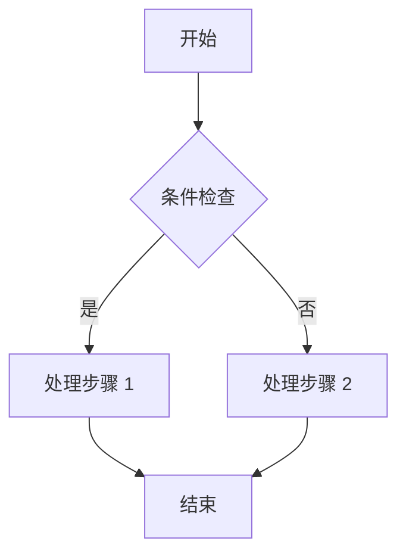
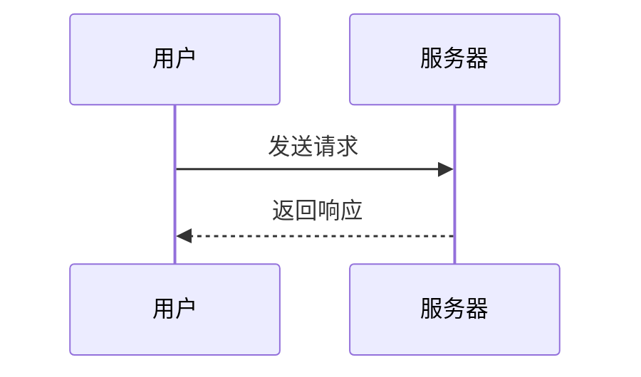

$$
\int_{-\infty}^{\infty} e^{-x^2} dx = \sqrt{\pi}
$$
$$
\begin{pmatrix}
a & b \\
c & d
\end{pmatrix}
$$

```mermaid
graph TD
    A[开始] --> B{条件检查}
    B -->|是| C[处理步骤 1]
    B -->|否| D[处理步骤 2]
    C --> E[结束]
    D --> E
``` 

```mermaid
sequenceDiagram
    participant User as 用户
    participant Server as 服务器
    User->>Server: 发送请求
    Server-->>User: 返回响应
```